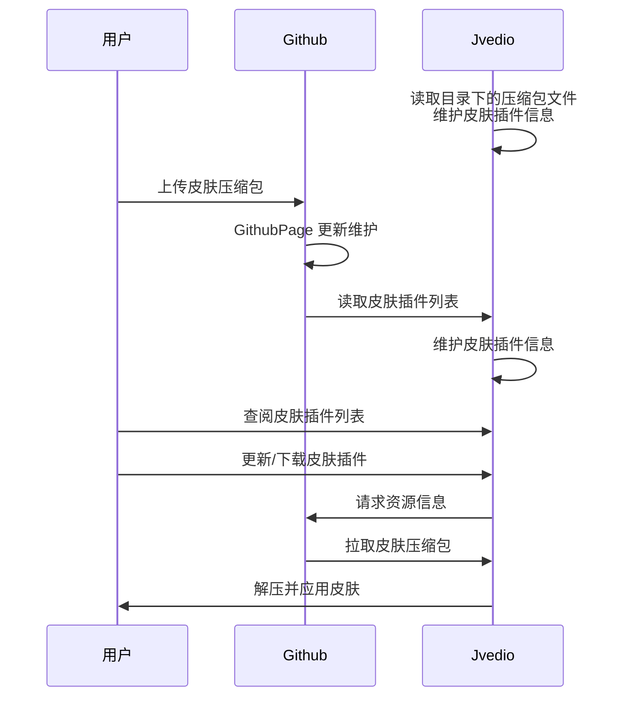

# 皮肤插件

用户自制插件，上传到 Github ，Jvedio 读取、下载并应用皮肤的流程


```mermaid
sequenceDiagram
participant 用户
participant Github
participant Jvedio
Jvedio ->> Jvedio: 读取目录下的压缩包文件<br/>维护皮肤插件信息
用户 ->> Github: 上传皮肤压缩包
Github ->> Github: GithubPage 更新维护
Github ->> Jvedio: 读取皮肤插件列表
Jvedio ->> Jvedio: 维护皮肤插件信息
用户 ->> Jvedio: 查阅皮肤插件列表
用户 ->> Jvedio: 更新/下载皮肤插件
Jvedio ->> Github: 请求资源信息
Github ->> Jvedio: 拉取皮肤压缩包
Jvedio ->> 用户: 解压并应用皮肤
```

皮肤压缩包目录

```c
皮肤名称（UTF-8）
	|-main.json		// 存放皮肤基本信息
    |-images		// 存放图片信息
```

main.json

```json
```


