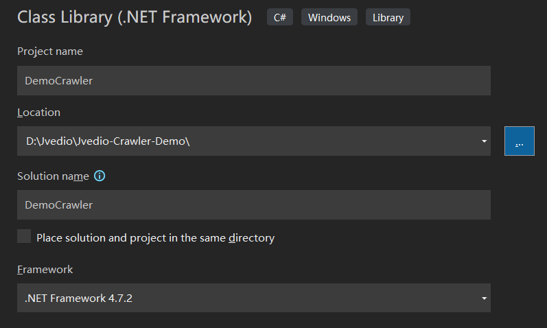
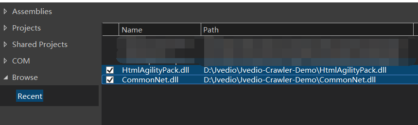
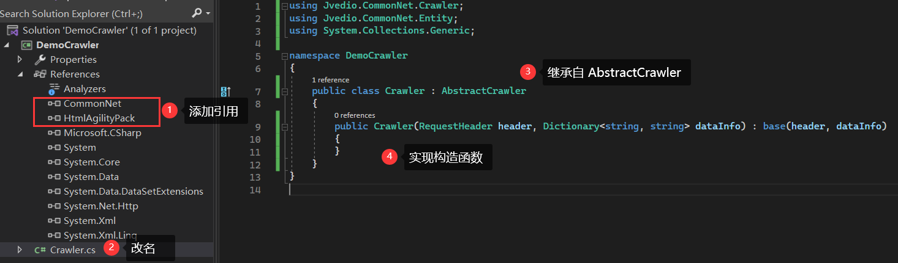
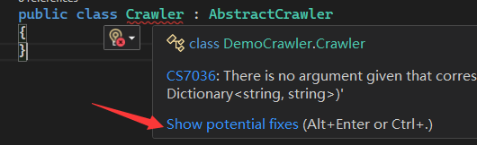
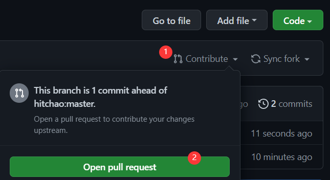
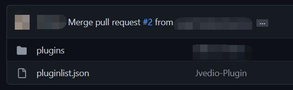

# 目录

- 信息同步插件
  - 开发说明
  - 上传插件
- 皮肤插件
  - 开发说明

# 插件

目前插件支持两种：

- 信息同步插件
- 皮肤插件

# 信息同步插件

## c# 开发

以下步骤为如何开发一个信息同步插件（c# 语言）

打开 Visual Studio 2022，新建一个 `Class Library(.NET Framework)` 项目，Framework 选择 `.NET Framework 4.7.2`



下载 `HtmlAgilityPack.dll` 和 `CommonNet.dll`，其中可以在 nuget 下载，但版本必须指定为 `1.11.42.0`，然后添加到引用



按如下新建一个爬虫类：

1. 添加上述两个 dll 引用
2. 更改名称为 `Crawler`
3. 继承类：`AbstractCrawler`
4. 实现构造函数（实现构造函数可以在 Crawler 上鼠标悬停后点击 Show potential fixes，让 IDE 自动实现）





抽象类 `AbstractCrawler` 具有以下属性及方法

**构造器**

```c#
public AbstractCrawler(RequestHeader header, Dictionary<string, string> dataInfo)
```

**属性**

| 属性       | 类型                       | 说明                      |
| ---------- | -------------------------- | ------------------------- |
| VID        | string                     | 视频识别码                |
| VideoType  | 枚举                       | 视频类型                  |
| BaseUrl    | string                     | 用户传入的基础网址        |
| DataInfo   | Dictionary<string, string> | 传入的视频信息            |
| HtmlText   | string                     | http 请求的文本内容，选用 |
| Header     | RequestHeader              | 用户传入的 header         |
| httpResult | HttpResult                 | http 请求的结果，选用     |

**方法**

| 方法名       | 说明                                                         |
| ------------ | ------------------------------------------------------------ |
| ParseUrl     | 该方法需要把基础地址（如 `https://www.baidu.com/`）进行处理，处理为对应目标的地址，如 `https://www.baidu.com/古惑仔之战无不胜` |
| GetInfo      | 该方法需要对上述 ParseUrl 后的地址发起 http 请求，然后解析返回的 html，将信息放到字典中返回 |
| GetInfoByUrl | 该方法直接跳过了 ParseUrl 的过程，根据用户传入的 url 地址发起 http 请求并解析 |

重写以下几个方法

- ParseUrl
- GetInfo
- GetInfoByUrl

```c#
public override void ParseUrl()
{
    base.ParseUrl();
}

public override async Task<Dictionary<string, object>> GetInfo(bool actor = false)
{
    return null;
}

public override Task<Dictionary<string, object>> GetInfoByUrl(string url, bool actor = false)
{
    return base.GetInfoByUrl(url, actor);
}
```

以下是一个完整的示例代码（以下示例没法运行），参考 [demo]()

```c#
public class Crawler : AbstractCrawler
{
    public Crawler(RequestHeader header, Dictionary<string, string> dataInfo) : base(header, dataInfo)
    {
    }

    public override async Task<Dictionary<string, object>> GetInfo(bool actor = false)
    {
        if (actor)
        {
            return await GetActorInfo();
        }
        else
        {
            return await GetDataInfo();
        }
    }

    private async Task<Dictionary<string, object>> GetActorInfo()
    {
        return null;
    }

    public override async Task<Dictionary<string, object>> GetInfoByUrl(string url, bool actor = false)
    {
        return null;
    }


    public override void ParseUrl()
    {
        if (!BaseUrl.EndsWith("/")) BaseUrl += "/";
        BaseUrl += VID;
    }

    private async Task<Dictionary<string, object>> GetDataInfo()
    {
        httpResult = await Jvedio.CommonNet.HttpClient.Get(BaseUrl, Header);
        Dictionary<string, object> Info = new Dictionary<string, object>();
        if (!Info.ContainsKey("StatusCode")) Info.Add("StatusCode", httpResult.StatusCode);
        if (httpResult.StatusCode == HttpStatusCode.OK && !string.IsNullOrEmpty(httpResult.SourceCode))
        {
            HtmlText = httpResult.SourceCode;
            Info = Parse();
            Info.Add("WebUrl", BaseUrl);
            Info.Add("WebType", "bus");
            Task.Delay(Jvedio.CommonNet.Delay.SHORT_3).Wait();
        }
        if (!Info.ContainsKey("Error") && !string.IsNullOrEmpty(httpResult.Error))
            Info.Add("Error", httpResult.Error);
        if (!Info.ContainsKey("Error") && httpResult.StatusCode != HttpStatusCode.OK)
            Info.Add("Error", httpResult.StatusCode);
        return Info;
    }

    private Dictionary<string, object> Parse()
    {
        string host = new Uri(BaseUrl).GetLeftPart(UriPartial.Authority);
        string VideoType = "";
        string VID = "";
        string DataID = "";
        if (DataInfo != null)
        {
            if (DataInfo.ContainsKey("VideoType"))
                VideoType = DataInfo["VideoType"];
            if (DataInfo.ContainsKey("VID"))
                VID = DataInfo["VID"];
            if (DataInfo.ContainsKey("DataID"))
                DataID = DataInfo["DataID"];
        }


        Dictionary<string, object> result = new Dictionary<string, object>();
        if (string.IsNullOrEmpty(HtmlText)) return result;
        HtmlDocument doc = new HtmlDocument();
        doc.LoadHtml(HtmlText);
        //基本信息
        HtmlNodeCollection headerNodes = doc.DocumentNode.SelectNodes("//span[@class='header']");
        if (headerNodes != null)
        {
            foreach (HtmlNode headerNode in headerNodes)
            {
                if (headerNode == null) continue;
                string headerText = headerNode.InnerText;
                string content = "";
                HtmlNode node = null;
                HtmlNode linkNode = null;
                switch (headerText)
                {
                    case "發行日期:":
                        node = headerNode.ParentNode; if (node == null) break;
                        content = node.InnerText;
                        result.Add("ReleaseDate", Regex.Match(content, "[0-9]{4}-[0-9]{2}-[0-9]{2}").Value);
                        result.Add("Year", Regex.Match(content, "[0-9]{4}").Value);
                        break;
                    case "長度:":
                        node = headerNode.ParentNode; if (node == null) break;
                        content = node.InnerText;
                        result.Add("Duration", Regex.Match(content, "[0-9]+").Value);
                        break;
                    case "製作商:":
                        node = headerNode.ParentNode; if (node == null) break;
                        linkNode = node.SelectSingleNode("a"); if (linkNode == null) break;
                        content = linkNode.InnerText;
                        result.Add("Studio", content);
                        break;
                    case "系列:":
                        node = headerNode.ParentNode; if (node == null) break;
                        linkNode = node.SelectSingleNode("a"); if (linkNode == null) break;
                        content = linkNode.InnerText;
                        result.Add("Series", content);
                        break;
                    case "導演:":
                        node = headerNode.ParentNode; if (node == null) break;
                        linkNode = node.SelectSingleNode("a"); if (linkNode == null) break;
                        content = linkNode.InnerText;
                        result.Add("Director", content);
                        break;
                    default:
                        break;
                }
            }
        }

        //标题
        HtmlNodeCollection titleNodes = doc.DocumentNode.SelectNodes("//h3");
        if (titleNodes != null && titleNodes.Count > 0)
        {
            string title = titleNodes[0].InnerText;
            if (VideoType == "Europe")
                title = titleNodes[0].InnerText.Replace(VID, "");
            else
            {
                title = titleNodes[0].InnerText.ToUpper().Replace(VID.ToUpper(), "");
                if (title.StartsWith(" ")) title = title.Substring(1);
            }
            result.Add("Title", title);
        }


        //类别、演员

        List<string> actors = new List<string>();
        List<string> actorsid = new List<string>();
        HtmlNodeCollection actorsNodes = doc.DocumentNode.SelectNodes("//span[@class='genre']/a");
        if (actorsNodes != null)
        {
            foreach (HtmlNode actorsNode in actorsNodes)
            {
                if (actorsNode == null) continue;
                HtmlNode node = actorsNode.ParentNode; if (node == null) continue;

                if (node.Attributes["onmouseover"] != null)
                {
                    actors.Add(actorsNode.InnerText);//演员
                    string link = actorsNode.Attributes["href"]?.Value;
                    if (!string.IsNullOrEmpty(link) && link.IndexOf("/") >= 0)
                        actorsid.Add(link.Split('/').Last());
                }
            }

        }
        List<string> genres = new List<string>();
        HtmlNodeCollection genreNodes = doc.DocumentNode.SelectNodes("//span[@class='genre']/label/a");
        if (genreNodes != null)
        {
            foreach (HtmlNode genreNode in genreNodes)
            {
                genres.Add(genreNode.InnerText);
            }
        }
        result.Add("Genre", genres);

        if (actors.Count > 0 && actorsid.Count > 0)
        {
            result.Add("ActorNames", actors);
            result.Add("ActorIds", actorsid);
            List<string> url_a = new List<string>();//演员头像地址
            foreach (var item in actorsid)
            {
                if (string.IsNullOrEmpty(item)) continue;
                if (VideoType == "Censored")
                    url_a.Add($"{host}/pics/actress/{item}_a.jpg");
                else if (VideoType == "Europe")
                    url_a.Add(host.Replace("www", "images") + "/actress/" + item + "_a.jpg");
                else if (VideoType == "UnCensored")
                    url_a.Add($"{host}/imgs/actress/{item}.jpg");//UnCensored没有 _a
            }
            result.Add("ActressImageUrl", url_a);
        }

        //大图

        string bigimageurl = "";

        HtmlNodeCollection bigimgeNodes = doc.DocumentNode.SelectNodes("//a[@class='bigImage']");
        if (bigimgeNodes != null && bigimgeNodes.Count > 0)
        {
            bigimageurl = bigimgeNodes[0].Attributes["href"]?.Value;
            if (!string.IsNullOrEmpty(bigimageurl))
            {
                if (bigimageurl.IndexOf("http") < 0) bigimageurl = host + bigimageurl;
                result.Add("BigImageUrl", bigimageurl);

            }


        }

        //小图
        if (!string.IsNullOrEmpty(bigimageurl))
        {
            string movieid = GetMovidID(bigimageurl);
            string SmallImageUrl = "";
            if (bigimageurl.IndexOf("pics.dmm.co.jp") >= 0)
                SmallImageUrl = bigimageurl.Replace("pl.jpg", "ps.jpg");
            else if (!string.IsNullOrEmpty(movieid))
            {


                if (VideoType == "Censored")
                    SmallImageUrl = $"{host}/pics/thumb/{movieid}.jpg";
                else if (VideoType == "UnCensored")
                    SmallImageUrl = $"{host}/imgs/thumbs/{movieid}.jpg";
                else if (VideoType == "Europe")
                    SmallImageUrl = $"{host}/thumb/" + movieid + ".jpg";
            }
            if (!string.IsNullOrEmpty(SmallImageUrl))
                result.Add("SmallImageUrl", SmallImageUrl);
        }

        //预览图
        List<string> url_e = new List<string>();
        HtmlNodeCollection extrapicNodes = doc.DocumentNode.SelectNodes("//a[@class='sample-box']");
        if (extrapicNodes != null)
        {
            foreach (HtmlNode extrapicNode in extrapicNodes)
            {
                if (extrapicNode == null) continue;
                string url = extrapicNode.Attributes["href"].Value;
                if (!url.StartsWith("http"))
                {
                    // 相对路径的图片
                    url = $"{host}{url}";
                }
                url_e.Add(url);
            }
            result.Add("ExtraImageUrl", url_e);
        }
        return result;
    }

    private string GetMovidID(string bigimageurl)
    {
        // => /pics/cover/89co_b.jpg
        try
        {
            return bigimageurl.Split('/').Last().Split('.').First().Replace("_b", "");
        }
        catch (Exception ex)
        {
            Logger.Error(ex);
            return null;
        }
    }
}
```

## python 开发

暂未支持

# 皮肤插件

## 使用说明

皮肤插件位于 `plugins/themes` 目录下，例如皮肤【一拳超人】，其目录结构如下

```bash
一拳超人
 |-main.json		# 保存皮肤基本信息
 |-images
 	|-bg.jpg		# 背景图片
 	|-plugin.png	# 在插件中显示的图片
 	|-small.jpg		# 在皮肤中显示的缩略图
 |-汉仪黑荔枝.ttf	 # 自定义字体
 |-readme.md		# readme.md
```

其中 main.json 格式说明如下

```json
{
    "PluginMetaData": {
        "PluginName": "【皮肤】一拳超人",// 皮肤名称
        "PluginType": 1,// 插件类型：0-信息同步，1-皮肤
        "Authors": [
            {
                "Name": "SuperStudio",
                "Github": "https://github.com/SuperStudio"
            }
        ],
        "ReleaseNotes": {
            "Version": "1.0.0",
            "Date": "2022-09-04",
            "Desc": "一拳超人",
            "MarkDown": "# 皮肤 \n Jvedio 一拳超人",// 显示在插件信息栏的 markdown 文档，不填则默认使用 readme.md
            "KeyWords": [
                {
                    "Key": "动漫",
                    "Value": "琦玉"
                }
            ]
        }
    },
    "Data": {
        "Images": {
            "Background": "./images/bg.jpg",// 需要展示的背景照片
            "Big": "./images/big.jpg",// 备用
            "Normal": "./images/default.jpg",// 备用
            "Small": "./images/small.jpg"// 用于在皮肤切换列表里显示的图片
        },
        "BgColorOpacity": 0.7,// 下面 Colors 所有带 Background 的颜色的透明度
        "Colors": {// 皮肤的颜色，如果不设置，默认黑色皮肤
            "Window.Background": "#1E1E1E",
            // ...
        }
    }
}
```

**在本地调试你的皮肤**

你可以复制现有的皮肤，起个新名字，每当你修改了本地的图片、颜色等信息，点击刷新可实时同步到 Jvedio 界面上。


## 上传自定义皮肤

在本地调试好自己的皮肤后，向 [Jvedio-Plugin](https://github.com/hitchao/Jvedio-Plugin) 提 Pull Request 即可，步骤如下：

1. 打开 [Jvedio-Plugin](https://github.com/hitchao/Jvedio-Plugin)，点击右上角 Fork

2. 在本地新建一个空目录，在当前目录下使用初始化仓库

```bash
git init
git config user.name "名字"
git config user.email "邮箱"
```

3. 添加远程地址并拉取代码

```bash
git remote add origin <你的 fork 之后的远程仓库地址>
# 拉取代码
git pull origin master
```

4. 本地添加自己的皮肤，在 pluginlist.json 中的 themes 下按照模板添加自己的皮肤信息，注意 PluginID 不可和已有的重复

```json
{
    "PluginID": "在本地的目录名",
    "PluginName": "插件名称",
    "Version": "1.1.0",
    "Date": "2022-06-23",
    "Desc": "描述信息"
}
```

5. 提交

```bash
git commit -m "修改版本号和关系"
git push origin master
```

6. 去到自己的 fork 的网址，点击 Contribute，再点击 Open pull request



7. 点击 Create pull request，然后等待审核即可，审核后在 [Jvedio-Plugin](https://github.com/hitchao/Jvedio-Plugin) 会显示如下内容



8. 大概需要 3-5 分钟等待部署，部署成功后打开 Jvedio 即可显示刚才上传的皮肤


